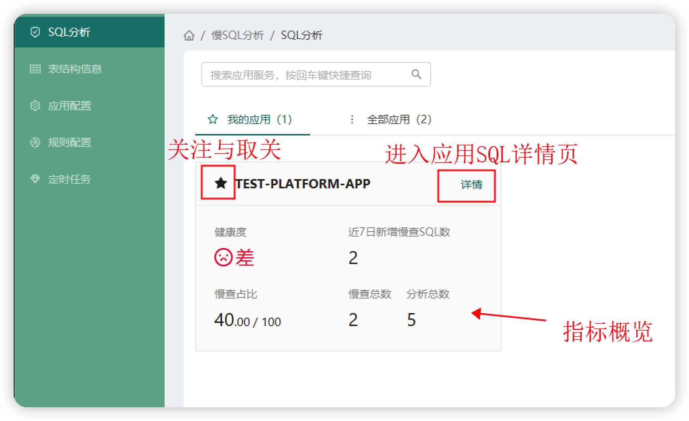
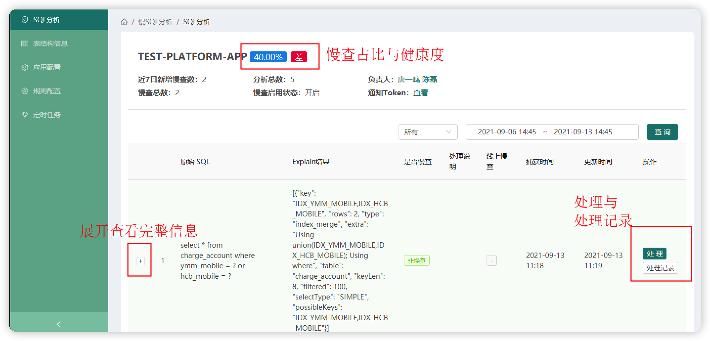
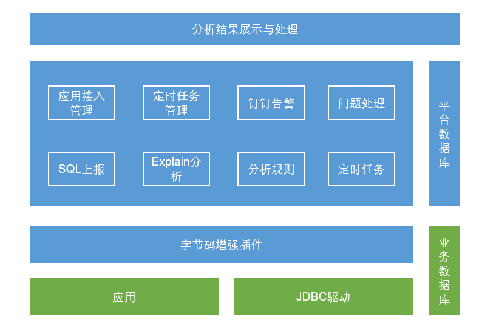

# 慢SQL检测

这个平台我是阅读参考了Tester Home上文章 [使用插桩技术解决慢查询测试问题](https://testerhome.com/topics/29228) 后实现的，之前在公司内部使用，现在改造开源了出来。由于时间仓促，改造中如果导致了Bug，希望各位提Issue告诉我，或者你帮助我修改也可以。

## 代码介绍
项目主要分四个部分：
- sql-capture-plugin

    一个sql语句的捕获插件，基于 [Gravity](https://github.com/ymm-tech/gravity) 的Java Agent开发，这是运满满开源的一款简洁优秀的字节码增强的AOP框架，得益于Gravity的开源，本项目才能够脱离我前公司环境构建并开源。

- sql-spring-plugin 
    
    一个Spring插件，用于应用加载capture插件后，可以先去调用服务端接口获取一下捕获规则

- sql-detect-server

    我们的平台服务端

- sql-detect-h5

    我们的平台前端

- sql-service-demo
    
    一个演示应用，可以用它来调试代码，查看捕获效果

## 准备工作
1. 根据DDL文件里的语句，建数据库和数据表
2. 导入sample data文件夹中的数据到响应库表中
3. clone [Gravity](https://github.com/ymm-tech/gravity) 项目,并本地编译打包好agent包
4. Maven 打包好我们的插件 sql-capture-plugin 和 sql-spring-plugin
5. 启动平台前后端
6. 启动演示demo应用，启动前修改启动配置：-javaagent:/YOUR-PATH/gravity-agent.jar=appName=sql-service-demo,localDebug=true
7. 第一次启动后，用户根目录会创建好.gravity的目录，将我们的插件拷贝到.gravity/sql-service-demo/agent/下，重新启动应用，其他应用同理拷贝到对应目录下。

这样，你就可以把玩应用，发起sql调用，观察捕获和数据分析了。

## 重要
这个平台的核心在于规则，使用什么样的规则来认定是慢查询，又需要忽略哪些语句，这需要大量的语句分析后经验的积累与优化了，我内置的规则只是最粗暴的一种，你需要自己结合实践去精细化他们。

## 优化，留给你自己来做了
- 数据上报使用消息中间件
- 定时任务管理使用XXL-JOB
- 智能化与问题相似度分析
- sql快慢等级

## 截图（部分功能未在截图内体现）

## 架构图

## 关于 Explain
Explain从Mysql 5.6开始并不会执行子查询，所以应用接入后不用担心影响原本DB性能，同时在5.6之后Explain开始在SELECT基础上增加支持 UPDATE/INSERT/DELETE/REPLACE等语句的执行计划解释（内部做了近似转换为Select语句）。
Explain命令执行不依赖数据量进行分析，所以在线下来说是个相对客观的分析，但是他只是一个脱离业务场景的纯执行解释的近似分析，最终判断，需要研发人员自己处理定夺。

## SQL语句捕获插件

### 1、拦截点
基于Java agent能力，开发插件，用于捕获应用发起的SQL调用信息。暂时只考虑针对mysql 5.x的版本进行插件实现。
为了简化拦截，可以一次性拿到全部底层的sql连接与语句信息，选择在jdbc驱动层对mysql-connector-java进行拦截，而不是直接在mybatis层拦截，只有mybaits的sql id需要从mybatis层拦截获取。
这样我们可以拦截到sql的mybatis的xml文件中的id，以及sql的原始语句，参数化拼接后的语句，与db连接所需的一切信息。获取到信息后进行数据上报存储。

### 2、数据上报策略
采用Http协议，调用服务端接口上报信息，同时使用ArraryBlockingQueue进行定时批量上报，减少连接数，直接在上报前也可以过滤掉很多重复SQL，优化性能。当然了也可以采用Websocket连接上报信息，或是引用MQ中间件临时存储需要分析的SQL语句，不过作为agent插件来说，引入这些有点重了。

## 服务端设计

### 1、数据上报开关
应用可以通过开关实时控制SQL上报记录分析与否，因为在服务端判断，所以agent端不会改变上报策略的停止与否。如果想在agent端进行控制，那么可以选择使用线程定时任务去拉最新的开关状态，也可以内置httpserver，通过外部接口调用来实时改变开关状态。
### 2、SQL过滤与保存
考虑到执行SQL的数量多，重复率高，时效性强，分析次数多等特性，需要对SQL语句设置必要的过滤策略：
同应用24H（未来考虑增加应用级别的过滤时间段可配置化）内相同的原始sql，无论有无分析过，只保存一条；
识别分库分表的相同语句进行重复过滤，对分库分表的表结构进行去重存储；
服务端应用慢查相关表语句过滤，避免循环调用，或者关闭服务端的插件；
过滤掉SELECT count(0) FROM 这种 PageHelper 插件分页查询时先执行的语句；
自定义需要过滤的sql语句；
### 3、SQL Explain分析的执行
通过jdbc直连DB进行执行explain分析，这样可以避免需要修改服务端配置来做db连接；
丢弃超过上报时段24小时，仍然一直分析执行失败的sql语句；
对于分析失败的语句分析时间间隔不应太短；
### 4、定时任务
通过Quartz定时任务来消费待分析的SQL。
定时任务：慢SQL检测
批量获取未做explain的语句进行分析执行；采用串行任务，防止任务执行时间过长，多任务拖死服务。
定时任务：慢SQL失败任务重检测
批量获取24H内执行分析失败的任务，重试分析。
定时任务：慢SQL定时告警
定时汇总应用的分析结果为慢查询的SQL语句数量，钉钉发送预警给应用负责人。
定时任务：DB表结构Hash值计算
定时的为落库的表结构进行Hash计算并存储值与计算时间。
### 5、慢查询的判断规则
对于explain结果key值为Null的，或者type值为 ALL，index，range其一的，将标记为慢查。
具体explain结果解释可参考官方文档：https://dev.mysql.com/doc/refman/5.7/en/explain-output.html#explain-join-types，也可以参考《高性能MySQL 第3版》附录D Explain章节。
### 6、慢查预警后的处理
你可以进行以下三种选择，确认非慢查忽略后的SQL，再DB表发生变更前，将不会再进行预警。
- 确认非慢查-忽略 
- 确认慢查-已优化
- 确认慢查-待处理
需要注意的是，你的每一次操作，都会被记录，如果发生线上问题，可以作为原因回溯。
### 7、汇总指标
分析总数：应用所有上报已执行分析数

慢查总数：应用所有标记为慢查的数量，已处理为非慢查的不算入其中

慢查占比 = 慢查总数 / 分析总数 （慢查为零则占比为 0%）

近7日新增慢查SQL数 = 慢查未处理数 + 慢查已处理数 （7日内）

慢查占比与健康度关系
- <= 0.1% 优秀
- <= 1.0% 良
- <= 2.0% 中 
- 其他 差

## 慢查询判断过滤逻辑

explain 时，如果本条数据为慢查，查找相同original sql的上一条数据：

如果上一条为慢查，直接标记为慢查；

如果上一条为非慢（无论explain的结果还是人工修改的），且没有指纹(即没有更新时间)，则跳过比较，直接标记为非慢。

如果上一条为非慢（无论explain的结果还是人工修改的），且表hash的更新时间早于上一条数据的创建时间，那么认为表结构无变更，标记为非慢；

如果上一条为非慢（无论explain的结果还是人工修改的），且表hash的更新时间晚于上一条数据的创建时间，那么认为表结构有变更，标记为慢查；

